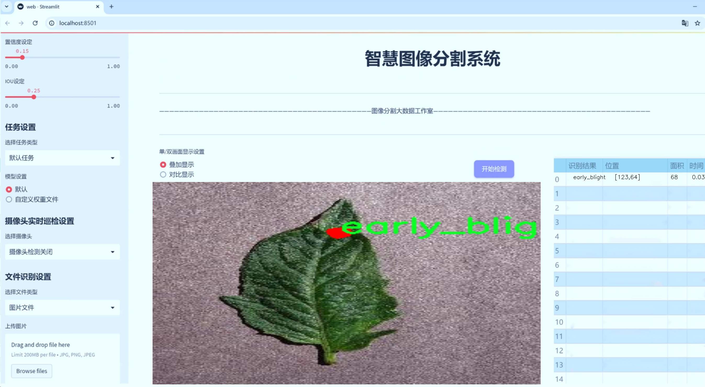
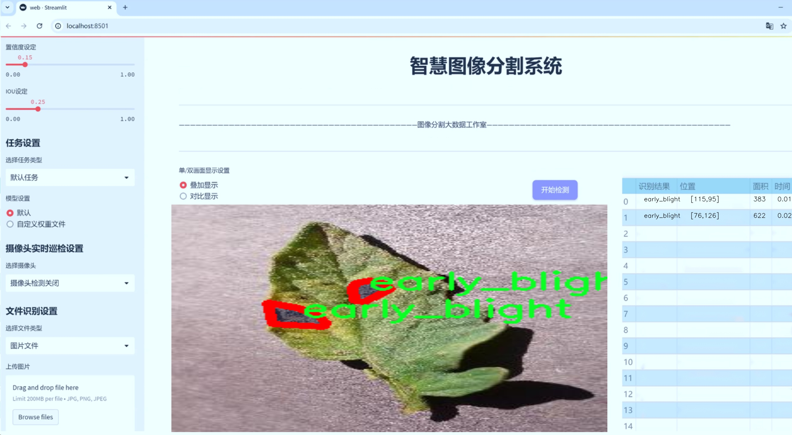
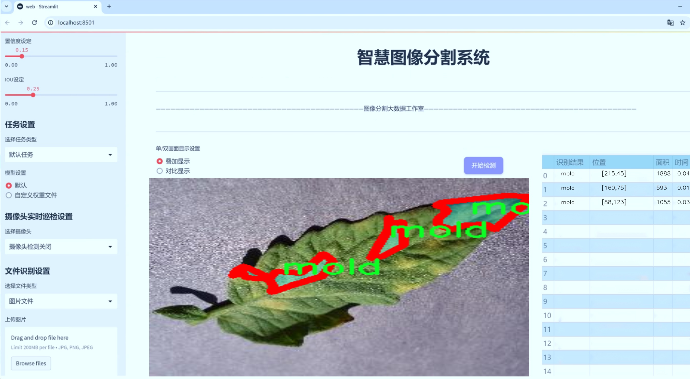

# 植物病害图像分割系统源码＆数据集分享
 [yolov8-seg-bifpn＆yolov8-seg-GFPN等50+全套改进创新点发刊_一键训练教程_Web前端展示]

### 1.研究背景与意义

项目参考[ILSVRC ImageNet Large Scale Visual Recognition Challenge](https://gitee.com/YOLOv8_YOLOv11_Segmentation_Studio/projects)

项目来源[AAAI Global Al lnnovation Contest](https://kdocs.cn/l/cszuIiCKVNis)

研究背景与意义

随着全球农业生产的不断发展，植物病害的监测与管理成为保障粮食安全和提高农作物产量的重要环节。植物病害不仅影响作物的生长和产量，还可能对生态环境造成负面影响。因此，及时、准确地识别和分类植物病害，对于农业生产的可持续发展具有重要意义。近年来，计算机视觉技术的迅猛发展为植物病害的自动检测与识别提供了新的思路和方法，尤其是深度学习技术的应用，使得图像处理和分析的效率大幅提升。

在众多深度学习模型中，YOLO（You Only Look Once）系列模型因其高效的实时目标检测能力而受到广泛关注。YOLOv8作为该系列的最新版本，结合了更为先进的网络结构和优化算法，具备了更强的特征提取能力和更快的推理速度。然而，传统的YOLOv8模型在处理植物病害图像时，往往面临着背景复杂、病害特征不明显等挑战。因此，针对植物病害图像的特征，改进YOLOv8模型以提升其在图像分割任务中的表现，具有重要的研究价值。

本研究所使用的数据集“new_plant_diseases”包含1200张图像，涵盖了10种不同类型的植物病害，包括细菌斑点、黑腐病、玉米北部叶枯病、早期枯萎病、白腐病、晚期枯萎病、叶烧病、霉菌、锈病和疮痂等。这些病害种类的多样性为模型的训练和评估提供了丰富的样本，有助于提高模型的泛化能力。通过对这些图像进行实例分割，不仅可以准确识别病害区域，还能够为后续的病害分析和防治措施提供依据。

在研究意义方面，基于改进YOLOv8的植物病害图像分割系统的构建，能够有效提升植物病害的检测精度和效率，为农业生产提供智能化的解决方案。该系统的应用不仅能够帮助农民及时发现和处理病害，减少农作物损失，还能为农业管理部门提供数据支持，推动农业信息化和智能化的发展。此外，研究成果还可以为相关领域的研究提供借鉴，促进计算机视觉技术在农业中的广泛应用。

综上所述，基于改进YOLOv8的植物病害图像分割系统的研究，不仅具有重要的理论价值，还具有广泛的应用前景。通过对植物病害的精准识别与分类，能够为农业生产的可持续发展提供有力支持，推动现代农业向智能化、精准化方向发展。

### 2.图片演示







##### 注意：由于此博客编辑较早，上面“2.图片演示”和“3.视频演示”展示的系统图片或者视频可能为老版本，新版本在老版本的基础上升级如下：（实际效果以升级的新版本为准）

  （1）适配了YOLOV8的“目标检测”模型和“实例分割”模型，通过加载相应的权重（.pt）文件即可自适应加载模型。

  （2）支持“图片识别”、“视频识别”、“摄像头实时识别”三种识别模式。

  （3）支持“图片识别”、“视频识别”、“摄像头实时识别”三种识别结果保存导出，解决手动导出（容易卡顿出现爆内存）存在的问题，识别完自动保存结果并导出到tempDir中。

  （4）支持Web前端系统中的标题、背景图等自定义修改，后面提供修改教程。

  另外本项目提供训练的数据集和训练教程,暂不提供权重文件（best.pt）,需要您按照教程进行训练后实现图片演示和Web前端界面演示的效果。

### 3.视频演示

[3.1 视频演示](https://www.bilibili.com/video/BV1ZQSvYZETG/)

### 4.数据集信息展示

##### 4.1 本项目数据集详细数据（类别数＆类别名）

nc: 10
names: ['bacterial_spot', 'black_rot', 'corn_northern_leaf_blight', 'early_blight', 'esca', 'late_blight', 'leaf scorch', 'mold', 'rust', 'scab']


##### 4.2 本项目数据集信息介绍

数据集信息展示

在现代农业生产中，植物病害的早期识别与处理至关重要。为了提升植物病害的自动检测与分割能力，本研究选用了名为“new_plant_diseases”的数据集，旨在训练和改进YOLOv8-seg模型，以实现高效、准确的植物病害图像分割。该数据集包含10个不同的植物病害类别，具体包括：细菌性斑点（bacterial_spot）、黑腐病（black_rot）、玉米北部叶枯病（corn_northern_leaf_blight）、早期枯萎病（early_blight）、葡萄枯萎病（esca）、晚疫病（late_blight）、叶焦病（leaf scorch）、霉菌（mold）、锈病（rust）和疮痂病（scab）。这些类别涵盖了多种常见的植物病害，具有较高的实用价值和研究意义。

数据集的构建过程经过了严格的筛选与标注，确保每一幅图像都能够准确反映相应病害的特征。每个类别的图像均来自于真实的农业环境，涵盖了不同的植物种类和生长阶段，使得模型在训练过程中能够学习到丰富的特征信息。这种多样性不仅提高了模型的泛化能力，也为其在实际应用中的表现奠定了基础。

在图像标注方面，数据集采用了精细化的分割标注技术，确保每个病害区域都被准确地框定。这种高质量的标注数据是训练深度学习模型的关键，能够有效提高模型对病害的识别率和分割精度。通过使用YOLOv8-seg模型，我们期望能够实现对植物病害的实时检测与分割，从而为农业生产提供及时的决策支持。

数据集的多样性和高质量标注使其在植物病害研究领域具有重要的参考价值。研究人员可以利用该数据集进行各种实验，包括模型的训练、验证和测试，探索不同算法在植物病害检测中的表现。此外，数据集的设计也为后续的研究提供了基础，其他研究者可以在此基础上进行改进与创新，推动植物病害自动检测技术的发展。

在未来的研究中，我们计划进一步扩展数据集的规模，增加更多的植物病害类别和样本，以提高模型的鲁棒性和适应性。同时，结合最新的深度学习技术，我们将探索如何优化YOLOv8-seg模型的结构和参数设置，以实现更高的分割精度和更快的推理速度。通过不断迭代和优化，我们希望能够为农业生产提供更为高效的病害检测解决方案，帮助农民及时发现和处理植物病害，提升作物产量和质量。

综上所述，“new_plant_diseases”数据集不仅为本研究提供了坚实的基础，也为植物病害检测领域的研究者们提供了宝贵的资源。通过对该数据集的深入分析与应用，我们期待能够推动植物病害检测技术的进步，为实现可持续农业发展贡献力量。


### 5.全套项目环境部署视频教程（零基础手把手教学）

[5.1 环境部署教程链接（零基础手把手教学）](https://www.bilibili.com/video/BV1jG4Ve4E9t/?vd_source=bc9aec86d164b67a7004b996143742dc)


[5.2 安装Python虚拟环境创建和依赖库安装视频教程链接（零基础手把手教学）](https://www.bilibili.com/video/BV1nA4VeYEze/?vd_source=bc9aec86d164b67a7004b996143742dc)

### 6.手把手YOLOV8-seg训练视频教程（零基础小白有手就能学会）

[6.1 手把手YOLOV8-seg训练视频教程（零基础小白有手就能学会）](https://www.bilibili.com/video/BV1cA4VeYETe/?vd_source=bc9aec86d164b67a7004b996143742dc)


按照上面的训练视频教程链接加载项目提供的数据集，运行train.py即可开始训练



     Epoch   gpu_mem       box       obj       cls    labels  img_size
     1/200     0G   0.01576   0.01955  0.007536        22      1280: 100%|██████████| 849/849 [14:42<00:00,  1.04s/it]
               Class     Images     Labels          P          R     mAP@.5 mAP@.5:.95: 100%|██████████| 213/213 [01:14<00:00,  2.87it/s]
                 all       3395      17314      0.994      0.957      0.0957      0.0843

     Epoch   gpu_mem       box       obj       cls    labels  img_size
     2/200     0G   0.01578   0.01923  0.007006        22      1280: 100%|██████████| 849/849 [14:44<00:00,  1.04s/it]
               Class     Images     Labels          P          R     mAP@.5 mAP@.5:.95: 100%|██████████| 213/213 [01:12<00:00,  2.95it/s]
                 all       3395      17314      0.996      0.956      0.0957      0.0845

     Epoch   gpu_mem       box       obj       cls    labels  img_size
     3/200     0G   0.01561    0.0191  0.006895        27      1280: 100%|██████████| 849/849 [10:56<00:00,  1.29it/s]
               Class     Images     Labels          P          R     mAP@.5 mAP@.5:.95: 100%|███████   | 187/213 [00:52<00:00,  4.04it/s]
                 all       3395      17314      0.996      0.957      0.0957      0.0845


### 7.50+种全套YOLOV8-seg创新点代码加载调参视频教程（一键加载写好的改进模型的配置文件）

[7.1 50+种全套YOLOV8-seg创新点代码加载调参视频教程（一键加载写好的改进模型的配置文件）](https://www.bilibili.com/video/BV1Hw4VePEXv/?vd_source=bc9aec86d164b67a7004b996143742dc)

### 8.YOLOV8-seg图像分割算法原理

原始YOLOV8-seg算法原理

YOLOv8-seg算法是目标检测领域中的一项重要进展，它在YOLO系列算法的基础上，进一步增强了对目标的分割能力，使得算法不仅能够识别目标的位置，还能够精确地 delineate 出目标的形状。这一进步源于对YOLOv8的多项创新性改进和深度学习技术的有效融合，尤其是在处理复杂场景和细粒度分割任务时，YOLOv8-seg展现出了其独特的优势。

首先，YOLOv8-seg在骨干网络的设计上延续了YOLOv8的跨级结构（Cross Stage Partial, CSP）思想，但在此基础上进行了优化。具体而言，YOLOv8-seg采用了C2f模块替代了YOLOv5中的C3模块，这一变化使得网络在特征提取过程中能够更有效地捕捉到多层次的信息。C2f模块通过分层卷积和特征连接的方式，能够在保留重要特征的同时，减少计算量，从而提高了模型的整体效率。

在特征提取方面，YOLOv8-seg保留了空间金字塔池化（SPP）模块，进一步增强了对不同尺度目标的检测能力。SPP模块通过多尺度特征的提取，能够有效地应对目标在图像中可能出现的各种尺寸变化。这一设计理念与YOLOv8的特征金字塔网络（FPN）相辅相成，使得YOLOv8-seg在处理复杂场景时，能够实现更高的准确性和鲁棒性。

YOLOv8-seg的检测网络采用了Anchor-Free的检测方式，这一创新使得模型在目标检测时不再依赖于预设的锚框，而是通过解耦头结构（Decoupled Head）直接进行目标的分类和定位。这种方法不仅简化了模型的设计，还提高了目标检测的灵活性，尤其是在面对形状各异的目标时，YOLOv8-seg能够展现出更好的适应性。

为了进一步提升分割精度，YOLOv8-seg引入了新的损失策略。与传统的损失函数不同，YOLOv8-seg采用了变焦损失（Focal Loss）来计算分类损失，同时结合数据平均保真度损失和完美交并比损失（IoU Loss）来评估边界框的准确性。这一损失策略的设计旨在减轻类别不平衡问题，确保模型在训练过程中能够更加关注难以分类的样本，从而提升整体的检测性能。

在数据处理方面，YOLOv8-seg采用了新的样本匹配方式，这一方法通过对样本的精细化处理，使得模型在训练时能够更好地学习到目标的特征。这种改进不仅提高了模型的训练效率，还增强了其在实际应用中的表现，使得YOLOv8-seg能够在高效率的基础上，保持较高的准确性。

此外，YOLOv8-seg还结合了注意力机制，这一机制能够帮助模型在特征提取过程中，自动关注图像中最重要的部分，从而提升分割的精度和细致度。通过对特征图的加权，注意力机制使得模型能够更好地捕捉到目标的细节，尤其是在复杂背景下，能够有效地减少误检和漏检的情况。

在实际应用中，YOLOv8-seg被广泛应用于各种场景，如智能监控、自动驾驶、医学影像分析等。其高效的目标检测和分割能力，使得它在这些领域中展现出了良好的应用前景。例如，在医学影像分析中，YOLOv8-seg能够帮助医生更准确地识别和分割病灶区域，从而为后续的诊断和治疗提供有力支持。

综上所述，YOLOv8-seg算法通过对YOLOv8的多项创新性改进，结合了轻量化的特征提取网络、Anchor-Free检测方式以及先进的损失策略，展现出了在目标检测和分割任务中的卓越性能。其高效性和准确性使得YOLOv8-seg成为当前目标检测领域中的一项重要工具，为各类应用场景提供了强有力的技术支持。随着技术的不断进步，YOLOv8-seg无疑将在未来的研究和应用中发挥更为重要的作用。


### 9.系统功能展示（检测对象为举例，实际内容以本项目数据集为准）

图9.1.系统支持检测结果表格显示

  图9.2.系统支持置信度和IOU阈值手动调节

  图9.3.系统支持自定义加载权重文件best.pt(需要你通过步骤5中训练获得)

  图9.4.系统支持摄像头实时识别

  图9.5.系统支持图片识别

  图9.6.系统支持视频识别

  图9.7.系统支持识别结果文件自动保存

  图9.8.系统支持Excel导出检测结果数据


### 10.50+种全套YOLOV8-seg创新点原理讲解（非科班也可以轻松写刊发刊，V11版本正在科研待更新）

#### 10.1 由于篇幅限制，每个创新点的具体原理讲解就不一一展开，具体见下列网址中的创新点对应子项目的技术原理博客网址【Blog】：


[10.1 50+种全套YOLOV8-seg创新点原理讲解链接](https://gitee.com/qunmasj/good)

#### 10.2 部分改进模块原理讲解(完整的改进原理见上图和技术博客链接)【如果此小节的图加载失败可以通过CSDN或者Github搜索该博客的标题访问原始博客，原始博客图片显示正常】
### FasterNet简介
神经网络在图像分类、检测和分割等各种计算机视觉任务中经历了快速发展。尽管其令人印象深刻的性能为许多应用程序提供了动力，但一个巨大的趋势是追求具有低延迟和高吞吐量的快速神经网络，以获得良好的用户体验、即时响应和安全原因等。

如何快速？研究人员和从业者不需要更昂贵的计算设备，而是倾向于设计具有成本效益的快速神经网络，降低计算复杂度，主要以浮点运算（FLOPs）的数量来衡量。

MobileNet、ShuffleNet和GhostNet等利用深度卷积（DWConv）和/或组卷积（GConv）来提取空间特征。然而，在减少FLOPs的过程中，算子经常会受到内存访问增加的副作用的影响。MicroNet进一步分解和稀疏网络，将其FLOPs推至极低水平。尽管这种方法在FLOPs方面有所改进，但其碎片计算效率很低。此外，上述网络通常伴随着额外的数据操作，如级联、Shuffle和池化，这些操作的运行时间对于小型模型来说往往很重要。

除了上述纯卷积神经网络（CNNs）之外，人们对使视觉Transformer（ViTs）和多层感知器（MLP）架构更小更快也越来越感兴趣。例如，MobileViT和MobileFormer通过将DWConv与改进的注意力机制相结合，降低了计算复杂性。然而，它们仍然受到DWConv的上述问题的困扰，并且还需要修改的注意力机制的专用硬件支持。使用先进但耗时的标准化和激活层也可能限制其在设备上的速度。

所有这些问题一起导致了以下问题：这些“快速”的神经网络真的很快吗？为了回答这个问题，作者检查了延迟和FLOPs之间的关系，这由


其中FLOPS是每秒浮点运算的缩写，作为有效计算速度的度量。虽然有许多减少FLOPs的尝试，但都很少考虑同时优化FLOPs以实现真正的低延迟。为了更好地理解这种情况，作者比较了Intel CPU上典型神经网络的FLOPS。


图中的结果表明，许多现有神经网络的FLOPS较低，其FLOPS通常低于流行的ResNet50。由于FLOPS如此之低，这些“快速”的神经网络实际上不够快。它们的FLOPs减少不能转化为延迟的确切减少量。在某些情况下，没有任何改善，甚至会导致更糟的延迟。例如，CycleMLP-B1具有ResNet50的一半FLOPs，但运行速度较慢（即CycleMLPB1与ResNet50:111.9ms与69.4ms）。

请注意，FLOPs与延迟之间的差异在之前的工作中也已被注意到，但由于它们采用了DWConv/GConv和具有低FLOPs的各种数据处理，因此部分问题仍未解决。人们认为没有更好的选择。

该博客提供的方案通过开发一种简单、快速、有效的运算符来消除这种差异，该运算符可以在减少FLOPs的情况下保持高FLOPS。

具体来说，作者重新审视了现有的操作符，特别是DWConv的计算速度——FLOPS。作者发现导致低FLOPS问题的主要原因是频繁的内存访问。然后，作者提出了PConv作为一种竞争性替代方案，它减少了计算冗余以及内存访问的数量。

图1说明了PConv的设计。它利用了特征图中的冗余，并系统地仅在一部分输入通道上应用规则卷积（Conv），而不影响其余通道。本质上，PConv的FLOPs低于常规Conv，而FLOPs高于DWConv/GConv。换句话说，PConv更好地利用了设备上的计算能力。PConv在提取空间特征方面也很有效，这在本文后面的实验中得到了验证。

作者进一步引入PConv设计了FasterNet作为一个在各种设备上运行速度非常快的新网络家族。特别是，FasterNet在分类、检测和分割任务方面实现了最先进的性能，同时具有更低的延迟和更高的吞吐量。例如，在GPU、CPU和ARM处理器上，小模型FasterNet-T0分别比MobileVitXXS快3.1倍、3.1倍和2.5倍，而在ImageNet-1k上的准确率高2.9%。大模型FasterNet-L实现了83.5%的Top-1精度，与Swin-B不相上下，同时在GPU上提供了49%的高吞吐量，在CPU上节省了42%的计算时间。

总之，贡献如下：

指出了实现更高FLOPS的重要性，而不仅仅是为了更快的神经网络而减少FLOPs。

引入了一种简单但快速且有效的卷积PConv，它很有可能取代现有的选择DWConv。

推出FasterNet，它在GPU、CPU和ARM处理器等多种设备上运行良好且普遍快速。

对各种任务进行了广泛的实验，并验证了PConv和FasterNet的高速性和有效性。

### Conv和FasterNet的设计
#### 原理

DWConv是Conv的一种流行变体，已被广泛用作许多神经网络的关键构建块。对于输入，DWConv应用个滤波器来计算输出。如图（b）所示，每个滤波器在一个输入通道上进行空间滑动，并对一个输出通道做出贡献。

与具有的FLOPs常规Conv相比，这种深度计算使得DWConv仅仅具有的FLOPs。虽然在减少FLOPs方面有效，但DWConv（通常后跟逐点卷积或PWConv）不能简单地用于替换常规Conv，因为它会导致严重的精度下降。因此，在实践中，DWConv的通道数（或网络宽度）增加到＞以补偿精度下降，例如，倒置残差块中的DWConv宽度扩展了6倍。然而，这会导致更高的内存访问，这会造成不可忽略的延迟，并降低总体计算速度，尤其是对于I/O绑定设备。特别是，内存访问的数量现在上升到


它比一个常规的Conv的值要高，即，


注意，内存访问花费在I/O操作上，这被认为已经是最小的成本，很难进一步优化。

#### PConv作为一个基本的算子


在下面演示了通过利用特征图的冗余度可以进一步优化成本。如图所示，特征图在不同通道之间具有高度相似性。许多其他著作也涵盖了这种冗余，但很少有人以简单而有效的方式充分利用它。


具体而言，作者提出了一种简单的PConv，以同时减少计算冗余和内存访问。图4中的左下角说明了PConv的工作原理。它只需在输入通道的一部分上应用常规Conv进行空间特征提取，并保持其余通道不变。对于连续或规则的内存访问，将第一个或最后一个连续的通道视为整个特征图的代表进行计算。在不丧失一般性的情况下认为输入和输出特征图具有相同数量的通道。因此，PConv的FLOPs仅


对于典型的r＝1/4 ，PConv的FLOPs只有常规Conv的1/16。此外，PConv的内存访问量较小，即：


对于r＝1/4，其仅为常规Conv的1/4。

由于只有通道用于空间特征提取，人们可能会问是否可以简单地移除剩余的（c−）通道？如果是这样，PConv将退化为具有较少通道的常规Conv，这偏离了减少冗余的目标。

请注意，保持其余通道不变，而不是从特征图中删除它们。这是因为它们对后续PWConv层有用，PWConv允许特征信息流经所有通道。

#### PConv之后是PWConv


为了充分有效地利用来自所有通道的信息，进一步将逐点卷积（PWConv）附加到PConv。它们在输入特征图上的有效感受野看起来像一个T形Conv，与均匀处理补丁的常规Conv相比，它更专注于中心位置，如图5所示。为了证明这个T形感受野的合理性，首先通过计算位置的Frobenius范数来评估每个位置的重要性。


假设，如果一个职位比其他职位具有更大的Frobenius范数，则该职位往往更重要。对于正则Conv滤波器，位置处的Frobenius范数由计算，其中。


一个显著位置是具有最大Frobenius范数的位置。然后，在预训练的ResNet18中集体检查每个过滤器，找出它们的显著位置，并绘制显著位置的直方图。图6中的结果表明，中心位置是过滤器中最常见的突出位置。换句话说，中心位置的权重比周围的更重。这与集中于中心位置的T形计算一致。

虽然T形卷积可以直接用于高效计算，但作者表明，将T形卷积分解为PConv和PWConv更好，因为该分解利用了滤波器间冗余并进一步节省了FLOPs。对于相同的输入和输出，T形Conv的FLOPs可以计算为:


它高于PConv和PWConv的流量，即：


其中和（例如，当时）。此外，可以很容易地利用常规Conv进行两步实现。

# FasterNet作为Backbone
鉴于新型PConv和现成的PWConv作为主要的算子，进一步提出FasterNet，这是一个新的神经网络家族，运行速度非常快，对许多视觉任务非常有效。目标是使体系结构尽可能简单，使其总体上对硬件友好。


在图中展示了整体架构。它有4个层次级，每个层次级前面都有一个嵌入层（步长为4的常规4×4卷积）或一个合并层（步长为2的常规2×2卷积），用于空间下采样和通道数量扩展。每个阶段都有一堆FasterNet块。作者观察到，最后两个阶段中的块消耗更少的内存访问，并且倾向于具有更高的FLOPS，如表1中的经验验证。因此，放置了更多FasterNet块，并相应地将更多计算分配给最后两个阶段。每个FasterNet块有一个PConv层，后跟2个PWConv（或Conv 1×1）层。它们一起显示为倒置残差块，其中中间层具有扩展的通道数量，并且放置了Shorcut以重用输入特征。

除了上述算子，标准化和激活层对于高性能神经网络也是不可或缺的。然而，许多先前的工作在整个网络中过度使用这些层，这可能会限制特征多样性，从而损害性能。它还可以降低整体计算速度。相比之下，只将它们放在每个中间PWConv之后，以保持特征多样性并实现较低的延迟。

此外，使用批次归一化（BN）代替其他替代方法。BN的优点是，它可以合并到其相邻的Conv层中，以便更快地进行推断，同时与其他层一样有效。对于激活层，根据经验选择了GELU用于较小的FasterNet变体，而ReLU用于较大的FasterNet变体，同时考虑了运行时间和有效性。最后三个层，即全局平均池化、卷积1×1和全连接层，一起用于特征转换和分类。

为了在不同的计算预算下提供广泛的应用，提供FasterNet的Tiny模型、Small模型、Medium模型和Big模型变体，分别称为FasterNetT0/1/2、FasterNet-S、FasterNet-M和FasterNet-L。它们具有相似的结构，但深度和宽度不同。

架构规范如下：


### 11.项目核心源码讲解（再也不用担心看不懂代码逻辑）

#### 11.1 ultralytics\models\fastsam\__init__.py

以下是对提供代码的逐文件分析和核心部分的保留，同时进行了详细的中文注释：

```python
# Ultralytics YOLO 🚀, AGPL-3.0 license

# 从当前包中导入 FastSAM 模型类
from .model import FastSAM
# 从当前包中导入 FastSAMPredictor 类，用于进行预测
from .predict import FastSAMPredictor
# 从当前包中导入 FastSAMPrompt 类，用于处理提示信息
from .prompt import FastSAMPrompt
# 从当前包中导入 FastSAMValidator 类，用于验证模型的性能
from .val import FastSAMValidator

# 定义当前模块的公共接口，包含可以被外部访问的类
__all__ = 'FastSAMPredictor', 'FastSAM', 'FastSAMPrompt', 'FastSAMValidator'
```

### 核心部分分析：
1. **模块导入**：
   - 代码通过相对导入的方式引入了多个类，这些类分别负责模型的不同功能。
   - `FastSAM` 是模型的核心类，可能包含模型的定义和训练方法。
   - `FastSAMPredictor` 是用于进行推理和预测的类。
   - `FastSAMPrompt` 可能用于处理用户输入或提示信息。
   - `FastSAMValidator` 用于验证模型的性能，确保模型在测试集上的表现。

2. **公共接口定义**：
   - `__all__` 列表定义了模块的公共接口，只有在使用 `from module import *` 时，列出的类才会被导入。这是一种控制模块导出内容的方式，确保外部只访问到必要的部分。

### 注释说明：
- 注释详细解释了每一行代码的功能和目的，帮助理解代码的结构和模块之间的关系。

这个文件是一个Python模块的初始化文件，通常用于定义模块的公共接口。在这个特定的文件中，主要涉及到与FastSAM相关的几个类和功能。

首先，文件顶部有一个注释，提到这是Ultralytics YOLO项目的一部分，并且该项目遵循AGPL-3.0许可证。这表明该项目是开源的，用户可以自由使用和修改，但需要遵循相应的许可证条款。

接下来，文件通过`from ... import ...`语句导入了四个不同的组件。这些组件分别是`FastSAM`、`FastSAMPredictor`、`FastSAMPrompt`和`FastSAMValidator`。这些类或函数可能在其他文件中定义，具体功能如下：

- `FastSAM`：可能是与FastSAM模型相关的核心类，负责模型的构建和操作。
- `FastSAMPredictor`：这个类可能用于进行预测，利用FastSAM模型对输入数据进行推理。
- `FastSAMPrompt`：这个类可能涉及到与用户交互的功能，比如接收用户输入或提示。
- `FastSAMValidator`：这个类可能用于验证模型的性能或结果，确保模型输出的准确性。

最后，`__all__`变量定义了模块的公共接口，指定了当使用`from module import *`时，哪些名称会被导入。这里列出的名称是`FastSAMPredictor`、`FastSAM`、`FastSAMPrompt`和`FastSAMValidator`，这意味着这些是模块的主要功能部分，用户可以直接使用这些类而不需要知道模块内部的实现细节。

总体来说，这个初始化文件的主要作用是组织和暴露FastSAM相关的功能，使得用户能够方便地导入和使用这些功能。

#### 11.2 ultralytics\hub\utils.py

以下是经过简化和注释的核心代码部分：

```python
import os
import platform
import random
import sys
import threading
import time
from pathlib import Path
import requests
from ultralytics.utils import (ENVIRONMENT, LOGGER, ONLINE, RANK, SETTINGS, TESTS_RUNNING, TryExcept, __version__)

# 定义事件分析的 URL
EVENTS_URL = 'https://www.google-analytics.com/mp/collect?measurement_id=G-X8NCJYTQXM&api_secret=QLQrATrNSwGRFRLE-cbHJw'

class Events:
    """
    事件分析类，用于收集匿名事件数据。
    事件分析在设置中 sync=True 时启用，sync=False 时禁用。
    """

    def __init__(self):
        """初始化 Events 对象，设置默认值。"""
        self.events = []  # 存储事件的列表
        self.rate_limit = 60.0  # 事件发送的速率限制（秒）
        self.t = 0.0  # 速率限制计时器（秒）
        # 存储环境元数据
        self.metadata = {
            'cli': Path(sys.argv[0]).name == 'yolo',  # 判断是否通过 CLI 运行
            'install': 'git' if is_git_dir() else 'pip' if is_pip_package() else 'other',  # 安装方式
            'python': '.'.join(platform.python_version_tuple()[:2]),  # Python 版本
            'version': __version__,  # 当前版本
            'env': ENVIRONMENT,  # 环境信息
            'session_id': round(random.random() * 1E15),  # 随机生成的会话 ID
            'engagement_time_msec': 1000  # 参与时间（毫秒）
        }
        # 根据条件决定是否启用事件收集
        self.enabled = (
            SETTINGS['sync'] and 
            RANK in (-1, 0) and 
            not TESTS_RUNNING and 
            ONLINE and 
            (is_pip_package() or get_git_origin_url() == 'https://github.com/ultralytics/ultralytics.git')
        )

    def __call__(self, cfg):
        """
        尝试将新事件添加到事件列表，并在达到速率限制时发送事件。

        Args:
            cfg (IterableSimpleNamespace): 包含模式和任务信息的配置对象。
        """
        if not self.enabled:
            return  # 如果事件收集被禁用，则不执行任何操作

        # 尝试将事件添加到列表中
        if len(self.events) < 25:  # 限制事件列表最多 25 个事件
            params = {
                **self.metadata, 
                'task': cfg.task,
                'model': cfg.model if cfg.model in GITHUB_ASSETS_NAMES else 'custom'
            }
            if cfg.mode == 'export':
                params['format'] = cfg.format  # 如果模式是导出，添加格式参数
            self.events.append({'name': cfg.mode, 'params': params})

        # 检查速率限制
        t = time.time()
        if (t - self.t) < self.rate_limit:
            return  # 如果未超过速率限制，则不发送事件

        # 超过速率限制，发送事件
        data = {'client_id': SETTINGS['uuid'], 'events': self.events}  # 包含匿名 UUID 和事件列表
        smart_request('post', EVENTS_URL, json=data, retry=0, verbose=False)  # 发送 POST 请求

        # 重置事件列表和速率限制计时器
        self.events = []
        self.t = t

# 创建 Events 实例
events = Events()
```

### 代码注释说明：
1. **导入模块**：导入所需的模块和库。
2. **事件分析 URL**：定义用于发送事件数据的 URL。
3. **Events 类**：用于收集和发送事件数据的类。
   - `__init__` 方法：初始化事件列表、速率限制、元数据和启用状态。
   - `__call__` 方法：尝试添加事件并在达到速率限制时发送事件。
4. **事件发送逻辑**：检查是否启用事件收集，限制事件数量，检查速率限制，发送事件数据，并重置事件列表和计时器。

这个程序文件是Ultralytics YOLO项目中的一个工具模块，主要用于处理与Ultralytics Hub相关的请求和事件分析。文件中包含了一些重要的导入语句，定义了一些常量和函数，以及一个用于事件收集的类。

首先，文件导入了多个标准库和第三方库，包括`os`、`platform`、`random`、`sys`、`threading`、`time`和`requests`等。它还从`ultralytics.utils`模块中导入了一些工具函数和常量，例如日志记录器、环境变量和版本信息等。

接下来，定义了一些常量，例如`PREFIX`和`HELP_MSG`，用于在日志中输出信息。`HUB_API_ROOT`和`HUB_WEB_ROOT`则是Ultralytics Hub的API和网页根地址，分别从环境变量中获取。

文件中定义了多个函数：

1. `request_with_credentials(url: str)`: 这个函数用于在Google Colab环境中进行带有凭证的AJAX请求。如果不是在Colab环境中运行，会抛出一个`OSError`异常。函数内部使用JavaScript代码通过`fetch` API发送请求，并返回响应数据。

2. `requests_with_progress(method, url, **kwargs)`: 这个函数用于发送HTTP请求，并可选地显示下载进度条。它支持指定HTTP方法（如GET或POST），并通过`requests`库进行请求。如果设置了`progress`参数为True，则会显示进度条。

3. `smart_request(method, url, retry=3, timeout=30, thread=True, code=-1, verbose=True, progress=False, **kwargs)`: 这个函数实现了带有重试机制的HTTP请求。它支持指定请求方法、URL、重试次数、超时时间等参数，并在请求失败时进行指数退避重试。可以选择在单独的线程中执行请求。

接下来是`Events`类的定义。这个类用于收集匿名事件分析数据。它的构造函数初始化了一些属性，包括事件列表、速率限制、元数据和启用状态。事件收集功能根据配置文件中的设置决定是否启用。

`Events`类的`__call__`方法用于添加新事件到事件列表，并在达到速率限制时发送事件数据。该方法会检查事件列表的长度，并在达到速率限制时发送数据到Google Analytics的指定URL。

最后，文件在末尾创建了一个`Events`类的实例，用于在整个模块中收集事件数据。整体来看，这个模块为Ultralytics Hub提供了网络请求和事件分析的基础功能，方便开发者进行数据收集和调试。

#### 11.3 ultralytics\nn\extra_modules\dynamic_snake_conv.py

以下是经过简化和注释的核心代码部分：

```python
import torch
import torch.nn as nn

class DySnakeConv(nn.Module):
    def __init__(self, inc, ouc, k=3) -> None:
        super().__init__()
        # 初始化三个卷积层
        self.conv_0 = Conv(inc, ouc, k)  # 标准卷积
        self.conv_x = DSConv(inc, ouc, 0, k)  # 沿x轴的动态蛇形卷积
        self.conv_y = DSConv(inc, ouc, 1, k)  # 沿y轴的动态蛇形卷积
    
    def forward(self, x):
        # 将三个卷积的输出在通道维度上拼接
        return torch.cat([self.conv_0(x), self.conv_x(x), self.conv_y(x)], dim=1)

class DSConv(nn.Module):
    def __init__(self, in_ch, out_ch, morph, kernel_size=3, if_offset=True, extend_scope=1):
        super(DSConv, self).__init__()
        # 用于学习可变形偏移的卷积层
        self.offset_conv = nn.Conv2d(in_ch, 2 * kernel_size, 3, padding=1)
        self.bn = nn.BatchNorm2d(2 * kernel_size)  # 批归一化
        self.kernel_size = kernel_size

        # 定义沿x轴和y轴的动态蛇形卷积
        self.dsc_conv_x = nn.Conv2d(in_ch, out_ch, kernel_size=(kernel_size, 1), stride=(kernel_size, 1), padding=0)
        self.dsc_conv_y = nn.Conv2d(in_ch, out_ch, kernel_size=(1, kernel_size), stride=(1, kernel_size), padding=0)

        self.extend_scope = extend_scope
        self.morph = morph
        self.if_offset = if_offset

    def forward(self, f):
        # 计算偏移量
        offset = self.offset_conv(f)
        offset = self.bn(offset)
        offset = torch.tanh(offset)  # 将偏移量限制在[-1, 1]之间

        # 进行可变形卷积
        dsc = DSC(f.shape, self.kernel_size, self.extend_scope, self.morph)
        deformed_feature = dsc.deform_conv(f, offset, self.if_offset)

        # 根据形态选择对应的卷积操作
        if self.morph == 0:
            x = self.dsc_conv_x(deformed_feature.type(f.dtype))
        else:
            x = self.dsc_conv_y(deformed_feature.type(f.dtype))
        
        return x

class DSC(object):
    def __init__(self, input_shape, kernel_size, extend_scope, morph):
        self.num_points = kernel_size
        self.width = input_shape[2]
        self.height = input_shape[3]
        self.morph = morph
        self.extend_scope = extend_scope

        # 定义特征图的形状
        self.num_batch = input_shape[0]
        self.num_channels = input_shape[1]

    def _coordinate_map_3D(self, offset, if_offset):
        # 计算坐标映射
        device = offset.device
        y_offset, x_offset = torch.split(offset, self.num_points, dim=1)

        # 生成坐标网格
        y_center = torch.arange(0, self.width).repeat([self.height]).reshape(self.height, self.width).permute(1, 0).reshape([-1, self.width, self.height]).unsqueeze(0)
        x_center = torch.arange(0, self.height).repeat([self.width]).reshape(self.width, self.height).permute(0, 1).reshape([-1, self.width, self.height]).unsqueeze(0)

        # 根据形态生成新的坐标
        if self.morph == 0:
            y = torch.linspace(0, 0, 1)
            x = torch.linspace(-int(self.num_points // 2), int(self.num_points // 2), int(self.num_points))
        else:
            y = torch.linspace(-int(self.num_points // 2), int(self.num_points // 2), int(self.num_points))
            x = torch.linspace(0, 0, 1)

        y_new = y_center + y.reshape(-1, 1).repeat([1, self.width * self.height]).reshape([self.num_points, self.width, self.height]).unsqueeze(0)
        x_new = x_center + x.reshape(-1, 1).repeat([1, self.width * self.height]).reshape([self.num_points, self.width, self.height]).unsqueeze(0)

        # 应用偏移
        if if_offset:
            # 偏移处理逻辑
            pass  # 省略具体实现

        return y_new, x_new

    def _bilinear_interpolate_3D(self, input_feature, y, x):
        # 双线性插值实现
        pass  # 省略具体实现

    def deform_conv(self, input, offset, if_offset):
        # 进行可变形卷积
        y, x = self._coordinate_map_3D(offset, if_offset)
        deformed_feature = self._bilinear_interpolate_3D(input, y, x)
        return deformed_feature
```

### 代码注释说明：
1. **DySnakeConv 类**：定义了一个动态蛇形卷积层，包含标准卷积和两个方向的动态卷积。
2. **DSConv 类**：实现了动态蛇形卷积的具体逻辑，包括偏移量的计算和可变形卷积的执行。
3. **DSC 类**：负责计算坐标映射和执行双线性插值，生成变形后的特征图。
4. **forward 方法**：在 `DySnakeConv` 和 `DSConv` 中定义了前向传播过程，主要负责特征图的处理和输出。
5. **_coordinate_map_3D 和 _bilinear_interpolate_3D 方法**：分别用于计算坐标映射和执行双线性插值，具体实现细节被省略。

这个程序文件实现了一个动态蛇形卷积（Dynamic Snake Convolution）的模块，主要用于深度学习中的卷积操作。文件中定义了两个主要的类：`DySnakeConv` 和 `DSConv`，以及一个辅助类 `DSC`。

首先，`DySnakeConv` 类是一个卷积层的封装，它继承自 `nn.Module`。在初始化方法中，定义了三个卷积操作：`conv_0` 是标准卷积，`conv_x` 和 `conv_y` 是动态蛇形卷积，分别沿着 x 轴和 y 轴进行卷积。`forward` 方法将输入 `x` 通过这三个卷积操作处理后，将结果在通道维度上拼接（concatenate）并返回。

接下来，`DSConv` 类实现了动态蛇形卷积的具体逻辑。它的初始化方法中，除了输入和输出通道、卷积核大小等参数外，还定义了一个偏移卷积层 `offset_conv`，用于学习卷积核的可变形偏移。该类还定义了两个卷积层 `dsc_conv_x` 和 `dsc_conv_y`，分别用于处理沿 x 轴和 y 轴的卷积。`forward` 方法中，首先通过 `offset_conv` 计算偏移量，然后利用这些偏移量进行卷积操作，最后通过激活函数和归一化层处理结果。

`DSC` 类是一个辅助类，负责计算坐标映射和进行双线性插值。它的初始化方法中根据输入的形状和卷积核大小等参数设置了一些内部变量。`_coordinate_map_3D` 方法用于生成变形后的坐标映射，考虑了偏移量的影响。`_bilinear_interpolate_3D` 方法则实现了对输入特征图的双线性插值，以获得变形后的特征图。

整体来看，这个文件实现了一个灵活的卷积操作，能够根据输入特征图的内容动态调整卷积核的位置，从而提高卷积神经网络在处理复杂形状和结构数据时的表现。通过动态调整卷积核，模型能够更好地捕捉到输入数据中的重要特征。

#### 11.4 ultralytics\nn\modules\utils.py

以下是经过简化和注释的核心代码部分：

```python
import torch
import torch.nn.functional as F

def multi_scale_deformable_attn_pytorch(value: torch.Tensor, value_spatial_shapes: torch.Tensor,
                                        sampling_locations: torch.Tensor,
                                        attention_weights: torch.Tensor) -> torch.Tensor:
    """
    多尺度可变形注意力机制。

    参数:
    - value: 输入特征图，形状为 (batch_size, num_channels, num_heads, embed_dims)
    - value_spatial_shapes: 特征图的空间形状，形状为 (num_levels, 2)
    - sampling_locations: 采样位置，形状为 (batch_size, num_queries, num_heads, num_levels, num_points, 2)
    - attention_weights: 注意力权重，形状为 (batch_size, num_heads, num_queries, num_levels, num_points)

    返回:
    - output: 经过多尺度可变形注意力后的输出，形状为 (batch_size, num_queries, num_heads * embed_dims)
    """

    # 获取输入的维度信息
    bs, _, num_heads, embed_dims = value.shape
    _, num_queries, _, num_levels, num_points, _ = sampling_locations.shape

    # 将输入特征图按照空间形状分割成多个特征图
    value_list = value.split([H_ * W_ for H_, W_ in value_spatial_shapes], dim=1)

    # 将采样位置进行归一化处理
    sampling_grids = 2 * sampling_locations - 1
    sampling_value_list = []

    # 遍历每个尺度的特征图
    for level, (H_, W_) in enumerate(value_spatial_shapes):
        # 处理当前尺度的特征图
        value_l_ = (value_list[level].flatten(2).transpose(1, 2).reshape(bs * num_heads, embed_dims, H_, W_))

        # 处理当前尺度的采样位置
        sampling_grid_l_ = sampling_grids[:, :, :, level].transpose(1, 2).flatten(0, 1)

        # 使用双线性插值进行采样
        sampling_value_l_ = F.grid_sample(value_l_,
                                          sampling_grid_l_,
                                          mode='bilinear',
                                          padding_mode='zeros',
                                          align_corners=False)
        sampling_value_list.append(sampling_value_l_)

    # 重新排列注意力权重
    attention_weights = attention_weights.transpose(1, 2).reshape(bs * num_heads, 1, num_queries,
                                                                  num_levels * num_points)

    # 计算最终输出
    output = ((torch.stack(sampling_value_list, dim=-2).flatten(-2) * attention_weights).sum(-1).view(
        bs, num_heads * embed_dims, num_queries))

    return output.transpose(1, 2).contiguous()  # 返回形状为 (batch_size, num_queries, num_heads * embed_dims) 的输出
```

### 代码注释说明：
1. **函数定义**：`multi_scale_deformable_attn_pytorch` 函数实现了多尺度可变形注意力机制，接收输入特征图、空间形状、采样位置和注意力权重，并返回经过注意力机制处理后的输出。
  
2. **维度获取**：从输入的 `value` 和 `sampling_locations` 中提取出批量大小、头数、嵌入维度等信息。

3. **特征图分割**：根据特征图的空间形状，将输入特征图分割成多个尺度的特征图。

4. **归一化采样位置**：将采样位置进行归一化处理，以适应 `grid_sample` 函数的输入要求。

5. **特征图处理**：对每个尺度的特征图进行处理，使用 `grid_sample` 函数进行双线性插值采样。

6. **注意力权重处理**：调整注意力权重的形状，以便与采样结果进行逐元素相乘。

7. **输出计算**：将所有尺度的采样结果与注意力权重相乘并求和，得到最终的输出。

8. **返回值**：返回形状为 `(batch_size, num_queries, num_heads * embed_dims)` 的输出，符合后续处理的要求。

这个程序文件是Ultralytics YOLO项目中的一个工具模块，主要用于实现一些深度学习模型中常用的功能和操作。文件中包含了多个函数，下面逐一进行说明。

首先，文件导入了一些必要的库，包括`copy`、`math`、`numpy`和`torch`等。`torch`是PyTorch深度学习框架的核心库，`nn`模块则提供了构建神经网络所需的各种工具。

接下来，定义了一个名为`_get_clones`的函数，该函数用于创建一个给定模块的克隆列表。它接受两个参数：`module`和`n`，返回一个包含`n`个深拷贝模块的`ModuleList`，这在构建具有多个相同层的网络时非常有用。

然后是`bias_init_with_prob`函数，它根据给定的先验概率值初始化卷积或全连接层的偏置值。该函数使用了负对数几率的公式来计算偏置的初始值，确保模型在训练初期能够更好地收敛。

接下来是`linear_init_`函数，用于初始化线性模块的权重和偏置。它使用均匀分布在特定范围内初始化权重，并在存在偏置的情况下同样进行初始化。这个初始化方法有助于提高模型的训练效果。

`inverse_sigmoid`函数计算张量的反sigmoid函数。它首先将输入张量限制在0到1之间，然后计算其反sigmoid值。这个函数在一些特定的任务中可能会用到，例如在目标检测中处理概率值。

最后，`multi_scale_deformable_attn_pytorch`函数实现了多尺度可变形注意力机制。该函数接受多个参数，包括值张量、空间形状、采样位置和注意力权重。它通过对输入的值进行处理，计算出不同尺度下的注意力输出。具体来说，函数首先对输入的值进行分割和重塑，然后通过`F.grid_sample`函数对采样位置进行插值，最终结合注意力权重计算出输出结果。

整体来看，这个模块提供了一些基础的工具函数和多尺度注意力机制的实现，为YOLO模型的训练和推理提供了支持。

#### 11.5 ultralytics\trackers\basetrack.py

以下是经过简化和注释的核心代码部分：

```python
# 导入必要的库
from collections import OrderedDict
import numpy as np

# 定义跟踪状态的枚举类
class TrackState:
    """可能的物体跟踪状态枚举。"""
    New = 0      # 新跟踪
    Tracked = 1  # 正在跟踪
    Lost = 2     # 跟踪丢失
    Removed = 3  # 跟踪已移除

# 定义基础跟踪类
class BaseTrack:
    """物体跟踪的基础类，处理基本的跟踪属性和操作。"""

    _count = 0  # 全局跟踪ID计数器

    # 跟踪的基本属性
    track_id = 0          # 跟踪ID
    is_activated = False   # 跟踪是否被激活
    state = TrackState.New # 当前跟踪状态

    history = OrderedDict() # 跟踪历史记录
    features = []           # 特征列表
    curr_feature = None     # 当前特征
    score = 0              # 跟踪得分
    start_frame = 0        # 开始帧
    frame_id = 0           # 当前帧ID
    time_since_update = 0   # 自上次更新以来的时间

    # 多摄像头位置
    location = (np.inf, np.inf) # 初始位置设为无穷大

    @property
    def end_frame(self):
        """返回跟踪的最后帧ID。"""
        return self.frame_id

    @staticmethod
    def next_id():
        """递增并返回全局跟踪ID计数器。"""
        BaseTrack._count += 1
        return BaseTrack._count

    def activate(self, *args):
        """激活跟踪，使用提供的参数。"""
        raise NotImplementedError  # 抛出未实现异常

    def predict(self):
        """预测跟踪的下一个状态。"""
        raise NotImplementedError  # 抛出未实现异常

    def update(self, *args, **kwargs):
        """使用新观察结果更新跟踪。"""
        raise NotImplementedError  # 抛出未实现异常

    def mark_lost(self):
        """将跟踪标记为丢失。"""
        self.state = TrackState.Lost

    def mark_removed(self):
        """将跟踪标记为已移除。"""
        self.state = TrackState.Removed

    @staticmethod
    def reset_id():
        """重置全局跟踪ID计数器。"""
        BaseTrack._count = 0
```

### 代码注释说明：
1. **TrackState类**：定义了跟踪状态的不同枚举值，方便管理跟踪对象的状态。
2. **BaseTrack类**：作为物体跟踪的基础类，包含了跟踪所需的基本属性和方法。
3. **属性和方法**：
   - `track_id`：每个跟踪对象的唯一标识符。
   - `is_activated`：指示跟踪是否已激活。
   - `state`：当前跟踪状态，初始为新状态。
   - `history`：用于存储跟踪历史的有序字典。
   - `next_id`方法：生成新的跟踪ID。
   - `activate`、`predict`、`update`方法：这些方法需要在子类中实现，分别用于激活跟踪、预测下一个状态和更新跟踪。
   - `mark_lost`和`mark_removed`方法：用于更新跟踪状态为丢失或已移除。
   - `reset_id`方法：重置跟踪ID计数器，通常在重新开始跟踪时使用。

这个程序文件定义了一个用于对象跟踪的基础类 `BaseTrack`，以及一个用于表示跟踪状态的枚举类 `TrackState`。首先，`TrackState` 类定义了四种可能的跟踪状态：新建（New）、跟踪中（Tracked）、丢失（Lost）和已移除（Removed），这些状态可以帮助管理和监控对象在跟踪过程中的不同阶段。

接下来，`BaseTrack` 类是一个对象跟踪的基类，主要用于处理跟踪的基本属性和操作。类中定义了一些静态和实例属性，包括：

- `_count`：用于生成唯一的跟踪 ID 的计数器。
- `track_id`：当前跟踪对象的 ID。
- `is_activated`：一个布尔值，指示跟踪对象是否已激活。
- `state`：当前跟踪对象的状态，初始为新建状态。
- `history`：一个有序字典，用于存储跟踪历史。
- `features`：一个列表，用于存储特征信息。
- `curr_feature`：当前特征。
- `score`：跟踪的得分。
- `start_frame` 和 `frame_id`：跟踪开始的帧和当前帧的 ID。
- `time_since_update`：自上次更新以来的时间。
- `location`：用于多摄像头跟踪的位置信息，初始为无穷大。

`BaseTrack` 类还定义了一些方法，包括：

- `end_frame`：一个属性方法，返回跟踪的最后帧 ID。
- `next_id`：一个静态方法，用于递增并返回全局跟踪 ID 计数器。
- `activate`、`predict` 和 `update`：这些方法是抽象方法，具体实现需要在子类中定义。
- `mark_lost` 和 `mark_removed`：用于将跟踪状态标记为丢失或已移除的方法。
- `reset_id`：一个静态方法，用于重置全局跟踪 ID 计数器。

总体而言，这个文件为对象跟踪提供了一个基础框架，定义了跟踪对象的基本属性和方法，方便后续的具体实现和扩展。

### 12.系统整体结构（节选）

### 程序整体功能和构架概括

该程序是Ultralytics YOLO项目的一部分，主要用于深度学习中的目标检测和跟踪。程序的整体架构由多个模块组成，每个模块负责特定的功能。主要功能包括：

1. **模型构建与初始化**：`ultralytics\models\fastsam\__init__.py`模块负责初始化FastSAM模型及其相关组件，为用户提供简洁的接口以便于使用。
2. **工具函数**：`ultralytics\hub\utils.py`模块提供了一些网络请求和事件分析的工具函数，支持与Ultralytics Hub的交互。
3. **动态卷积实现**：`ultralytics\nn\extra_modules\dynamic_snake_conv.py`模块实现了动态蛇形卷积，增强了卷积神经网络在处理复杂数据时的能力。
4. **基础工具函数**：`ultralytics\nn\modules\utils.py`模块包含了一些常用的工具函数，如初始化、反sigmoid计算和多尺度注意力机制等，支持模型的训练和推理。
5. **对象跟踪基础类**：`ultralytics\trackers\basetrack.py`模块定义了对象跟踪的基础类和状态管理，为后续的跟踪算法提供了基础框架。

### 文件功能整理表

| 文件路径                                      | 功能描述                                                                                   |
|-----------------------------------------------|------------------------------------------------------------------------------------------|
| `ultralytics/models/fastsam/__init__.py`     | 初始化FastSAM模型及其相关组件，定义模块的公共接口。                                       |
| `ultralytics/hub/utils.py`                   | 提供网络请求和事件分析的工具函数，支持与Ultralytics Hub的交互。                          |
| `ultralytics/nn/extra_modules/dynamic_snake_conv.py` | 实现动态蛇形卷积，增强卷积神经网络处理复杂数据的能力。                                   |
| `ultralytics/nn/modules/utils.py`            | 包含常用的工具函数，如初始化、反sigmoid计算和多尺度注意力机制，支持模型的训练和推理。     |
| `ultralytics/trackers/basetrack.py`          | 定义对象跟踪的基础类和状态管理，为后续的跟踪算法提供基础框架。                           |

以上表格总结了每个文件的主要功能，展示了Ultralytics YOLO项目的模块化设计和各模块之间的协作关系。

注意：由于此博客编辑较早，上面“11.项目核心源码讲解（再也不用担心看不懂代码逻辑）”中部分代码可能会优化升级，仅供参考学习，完整“训练源码”、“Web前端界面”和“50+种创新点源码”以“14.完整训练+Web前端界面+50+种创新点源码、数据集获取”的内容为准。

### 13.图片、视频、摄像头图像分割Demo(去除WebUI)代码

在这个博客小节中，我们将讨论如何在不使用WebUI的情况下，实现图像分割模型的使用。本项目代码已经优化整合，方便用户将分割功能嵌入自己的项目中。
核心功能包括图片、视频、摄像头图像的分割，ROI区域的轮廓提取、类别分类、周长计算、面积计算、圆度计算以及颜色提取等。
这些功能提供了良好的二次开发基础。

### 核心代码解读

以下是主要代码片段，我们会为每一块代码进行详细的批注解释：

```python
import random
import cv2
import numpy as np
from PIL import ImageFont, ImageDraw, Image
from hashlib import md5
from model import Web_Detector
from chinese_name_list import Label_list

# 根据名称生成颜色
def generate_color_based_on_name(name):
    ......

# 计算多边形面积
def calculate_polygon_area(points):
    return cv2.contourArea(points.astype(np.float32))

...
# 绘制中文标签
def draw_with_chinese(image, text, position, font_size=20, color=(255, 0, 0)):
    image_pil = Image.fromarray(cv2.cvtColor(image, cv2.COLOR_BGR2RGB))
    draw = ImageDraw.Draw(image_pil)
    font = ImageFont.truetype("simsun.ttc", font_size, encoding="unic")
    draw.text(position, text, font=font, fill=color)
    return cv2.cvtColor(np.array(image_pil), cv2.COLOR_RGB2BGR)

# 动态调整参数
def adjust_parameter(image_size, base_size=1000):
    max_size = max(image_size)
    return max_size / base_size

# 绘制检测结果
def draw_detections(image, info, alpha=0.2):
    name, bbox, conf, cls_id, mask = info['class_name'], info['bbox'], info['score'], info['class_id'], info['mask']
    adjust_param = adjust_parameter(image.shape[:2])
    spacing = int(20 * adjust_param)

    if mask is None:
        x1, y1, x2, y2 = bbox
        aim_frame_area = (x2 - x1) * (y2 - y1)
        cv2.rectangle(image, (x1, y1), (x2, y2), color=(0, 0, 255), thickness=int(3 * adjust_param))
        image = draw_with_chinese(image, name, (x1, y1 - int(30 * adjust_param)), font_size=int(35 * adjust_param))
        y_offset = int(50 * adjust_param)  # 类别名称上方绘制，其下方留出空间
    else:
        mask_points = np.concatenate(mask)
        aim_frame_area = calculate_polygon_area(mask_points)
        mask_color = generate_color_based_on_name(name)
        try:
            overlay = image.copy()
            cv2.fillPoly(overlay, [mask_points.astype(np.int32)], mask_color)
            image = cv2.addWeighted(overlay, 0.3, image, 0.7, 0)
            cv2.drawContours(image, [mask_points.astype(np.int32)], -1, (0, 0, 255), thickness=int(8 * adjust_param))

            # 计算面积、周长、圆度
            area = cv2.contourArea(mask_points.astype(np.int32))
            perimeter = cv2.arcLength(mask_points.astype(np.int32), True)
            ......

            # 计算色彩
            mask = np.zeros(image.shape[:2], dtype=np.uint8)
            cv2.drawContours(mask, [mask_points.astype(np.int32)], -1, 255, -1)
            color_points = cv2.findNonZero(mask)
            ......

            # 绘制类别名称
            x, y = np.min(mask_points, axis=0).astype(int)
            image = draw_with_chinese(image, name, (x, y - int(30 * adjust_param)), font_size=int(35 * adjust_param))
            y_offset = int(50 * adjust_param)

            # 绘制面积、周长、圆度和色彩值
            metrics = [("Area", area), ("Perimeter", perimeter), ("Circularity", circularity), ("Color", color_str)]
            for idx, (metric_name, metric_value) in enumerate(metrics):
                ......

    return image, aim_frame_area

# 处理每帧图像
def process_frame(model, image):
    pre_img = model.preprocess(image)
    pred = model.predict(pre_img)
    det = pred[0] if det is not None and len(det)
    if det:
        det_info = model.postprocess(pred)
        for info in det_info:
            image, _ = draw_detections(image, info)
    return image

if __name__ == "__main__":
    cls_name = Label_list
    model = Web_Detector()
    model.load_model("./weights/yolov8s-seg.pt")

    # 摄像头实时处理
    cap = cv2.VideoCapture(0)
    while cap.isOpened():
        ret, frame = cap.read()
        if not ret:
            break
        ......

    # 图片处理
    image_path = './icon/OIP.jpg'
    image = cv2.imread(image_path)
    if image is not None:
        processed_image = process_frame(model, image)
        ......

    # 视频处理
    video_path = ''  # 输入视频的路径
    cap = cv2.VideoCapture(video_path)
    while cap.isOpened():
        ret, frame = cap.read()
        ......
```


### 14.完整训练+Web前端界面+50+种创新点源码、数据集获取


# [下载链接：https://mbd.pub/o/bread/Zp6Yk5xw](https://mbd.pub/o/bread/Zp6Yk5xw)